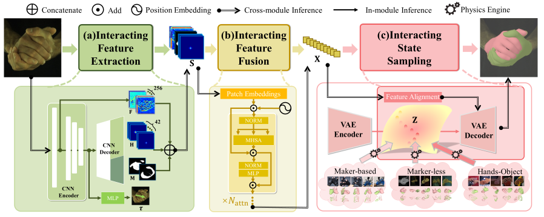

# InterPrior
Official repository for the paper: [Reconstructing Interacting Hands with Interaction Prior from Monocular Images](https://arxiv.org/abs/2308.14082)

<div align=center>

</div>

## News!
- We create our [webpage](https://www.yangangwang.com/papers/iccv2023_interprior/BinghuiZuo-ICCV2023_InterPrior.html), more details can be found from there.

## Citation
If you find our work is useful or want to use our dataset, please consider citing the paper.
```
@inproceedings{zuo2023reconstructing,
title={Reconstructing Interacting Hands with Interaction Prior from Monocular Images},
author={Zuo, Binghui and Zhao, Zimeng and Sun, Wenqian and Xie, Wei and Xue, Zhou and Wang, Yangang},
booktitle={Proceedings of the IEEE/CVF International Conference on Computer Vision},
year={2023},
}
```